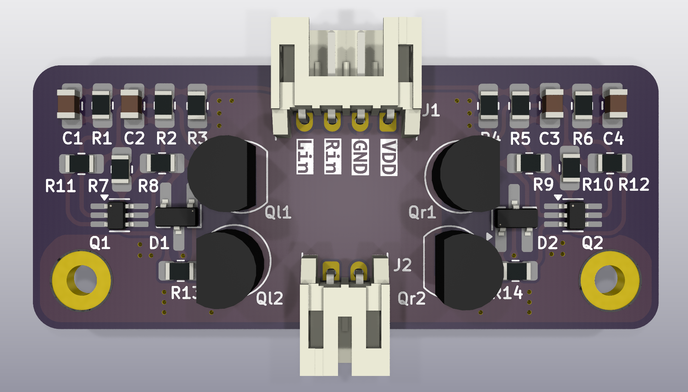

# H-Bridge Driver for 3.3V PWM Input (HI/LO)

This project is a discrete transistor-based H-bridge driver designed to drive loads such as a bi-directional LED string or small DC motors (you *need* to populate the protection diodes in that case!) using two 3.3V logic-level PWM inputs.





## Overview

The circuit takes two complementary (non-overlapping) PWM inputs: `L_IN` and `R_IN`, each at 3.3V logic level. These signals are level-shifted and drive a discrete H-bridge output stage composed of NPN and PNP BJTs. The output connects to a load (e.g., LED strip) in a push-pull fashion.

## Inputs

- `L_IN`: 3.3V logic PWM input (controls left-side NPN-PNP transistors)
- `R_IN`: 3.3V logic PWM input (controls right-side NPN-PNP transistors)

⚠️ **Important:**  
`L_IN` and `R_IN` **must be phase-shifted**, even though the NPN-PNP-pair makes sure shoot-through is impossible. If both are high simultaneously, the output is off.

## Supply

- `+5V`: Power rail for the H-bridge (used to drive the load)
- `GND`: Common ground

## Outputs

- `O1`, `O2`: Differential outputs to the load

## Notes

- Input resistors and capacitors are used for filtering and protection.
- BJTs are used in complementary pairs (NPN/PNP) for each half-bridge.
- I have not yet tested how much current this schematic can tolerate (depending on transistors and thermal limits). So far, 100mA worked fine without anything getting noticably warm. In theory, it should tolerate at least 250mA on each side of the H-Bridge, so at least 500mA in total, but this is so far untested.
- Load: connected between `O1` and `O2` (e.g., antiparallel LEDs or small DC motor)
- You can use [WLED](https://kno.wled.ge/) to drive the inputs - select "PWM CCT" as LED-type. For the phase-shifted PWM to work, you might need to use a beta version from [wled-install.github.io](https://wled-install.github.io/) - 0.16 nightly worked for me.  
- [ESPHome](https://esphome.io) works as well, see example below

```yaml
output:
  - platform: ledc
    id: pwm_l
    pin: 3
    frequency: 5kHz
    inverted: false
    phase_angle: 0.0

  - platform: ledc
    id: pwm_r
    pin: 4
    frequency: 5kHz
    inverted: false
    phase_angle: 180.0

  - platform: template
    id: pwm_bridge
    type: float
    write_action:
      lambda: |-
        float duty = clamp(state, 0.0f, 1.0f) * 0.5f;
        id(pwm_l).set_level(duty);
        id(pwm_r).set_level(duty);
        ESP_LOGD("custom", "H-Bridge Control: L=%.2f R=%.2f", duty, duty);
light:
  - platform: monochromatic
    name: "Bidirektionale Lampe"
    output: pwm_bridge

```


## Simulation


You can use KiCad's simulation tool to simulate the behaviour of this schematic. Modify the parameters of V1 and V2 to simulate different PWM patterns.

## Gerber files

You can download the gerber file directory as a zipfile and directly upload it to e.g. https://aisler.net, https://jlcpcb.com or https://pcbway.com

Special thanks to [PCBWay.com](https://pcbway.com) for reaching out to supply me with prototype PCBs; I'll update this section once I assembled and tested the boards. Kudos!

[Gerber file directory](production/npn-pnp-h-bridge)

## BOM

View [interactive BOM here](https://lk-ek.github.io/npn-pnp-h-bridge/)

| Designator         | Amount | Value   | Package |
|--------------------|--------|----------|----|
| C1, C2, C3, C4     | 4      | 100p     | 0805 
| D1, D2, D3, D4     | 4      | SS14 Schottky Diode | SMA |
| J1                 | 1      | JST S4B-PH-K-S | JST PH 2.0mm |
| J2                 | 1      | JST S2B-PH-K-S | JST PH 2.0mm |
| Q1, Q2, Q3, Q4     | 4      | MMBT3904 | SOT-23 |
| Ql1, Ql2           | 2      | BC327-25 | TO-92 |
| Qr1, Qr2           | 2      | BC337-25 | TO-92 |
| R1, R2, R5, R6     | 4      | 680      | 0805 |
| R3, R4             | 2      | 220k     | 0805 |
| R7, R10            | 2      | 4.7k       | 0805 |
| R11, R12           | 2      | 2.2k       | 0805 |
| R8, R9, R13, R14   | 4      | 180 1/4W | 0805 |

## License

Attribution-NonCommercial-ShareAlike 4.0 International

See LICENSE for details, or: https://creativecommons.org/licenses/by-nc-sa/4.0/
