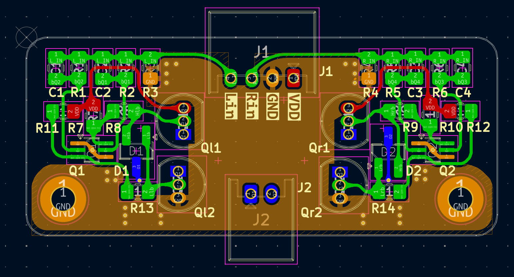
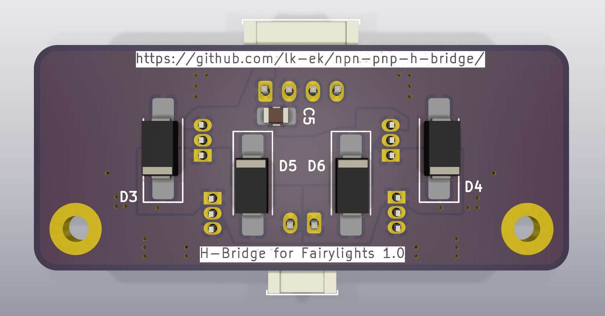
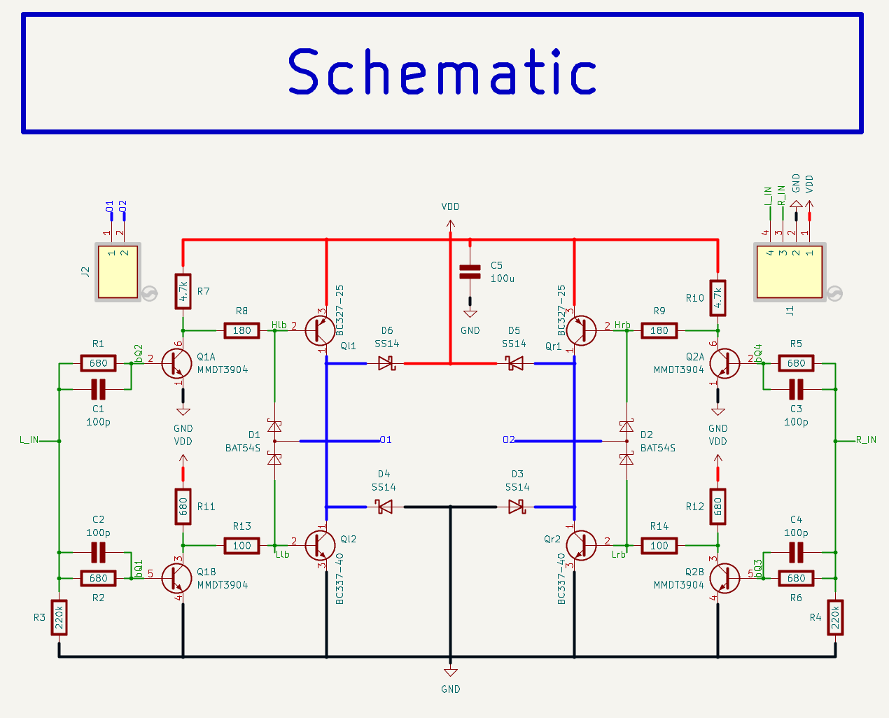

# H-Bridge Driver for 3.3V PWM Input (HI/LO)

This project is a discrete transistor-based H-bridge driver designed to drive loads such as a bi-directional LED string (NOT motors, you *need* to use protection diodes in that case!) using two 3.3V logic-level PWM inputs.

## Overview

The circuit takes two complementary (non-overlapping) PWM inputs: `HI_IN` and `LO_IN`, each at 3.3V logic level. These signals are level-shifted and drive a discrete H-bridge output stage composed of NPN and PNP BJTs. The output connects to a load (e.g., LED strip) in a push-pull fashion.

## Inputs

- `HI_IN`: 3.3V logic PWM input (controls left-side NPN-PNP transistors)
- `LO_IN`: 3.3V logic PWM input (controls right-side NPN-PNP transistors)

⚠️ **Important:**  
`HI_IN` and `LO_IN` **must be phase-shifted**, even though the NPN-PNP-pair makes sure shoot-through is impossible. If both are high simultaneously, the output is off.

## Supply

- `+5V`: Power rail for the H-bridge (used to drive the load)
- `GND`: Common ground

## Outputs

- `O1`, `O2`: Differential outputs to the load

## Notes

- Input resistors and capacitors are used for filtering and protection.
- BJTs are used in complementary pairs (NPN/PNP) for each half-bridge.
- I have not yet tested how much current this schematic can tolerate (depending on transistors and thermal limits).
- Load: connected between `O1` and `O2` (e.g., antiparallel LEDs)

## Simulation

You can use KiCad's simulation tool to simulate the behaviour of this schematic. Modify the parameters of V1 and V2 to simulate different PWM patterns.

## Gerber files

You can download the gerber file directory as a zipfile and directly upload it to e.g. https://aisler.net, https://jlcpcb.com or https://pcbway.com

[Gerber file directory](production/npn-pnp-h-bridge)

## BOM

| Designator         | Amount | Value   | Package |
|--------------------|--------|----------|----|
| C1, C2, C3, C4     | 4      | 100p     | 0805 |
| D1                 | 1      | Fairy Lights | |
| J1                 | 1      | JST S4B-PH-K-S | JST PH 2.0mm |
| J2                 | 1      | JST S2B-PH-K-S | JST PH 2.0mm |
| Q1, Q2, Q3, Q4     | 4      | MMBT3904 | SOT-23 |
| Qh1, Qh2           | 2      | BC327-25 | TO-92 |
| Ql1, Ql2           | 2      | BC337-25 | TO-92 |
| R1, R2, R5, R6     | 4      | 2.2k     | 0805 |
| R3, R4             | 2      | 220k     | 0805 |
| R7, R10–R14        | 6      | 1k       | 0805 |
| R8, R9             | 2      | 2k       | 0805 |

## License

Attribution-NonCommercial-ShareAlike 4.0 International

See LICENSE for details, or: https://creativecommons.org/licenses/by-nc-sa/4.0/
